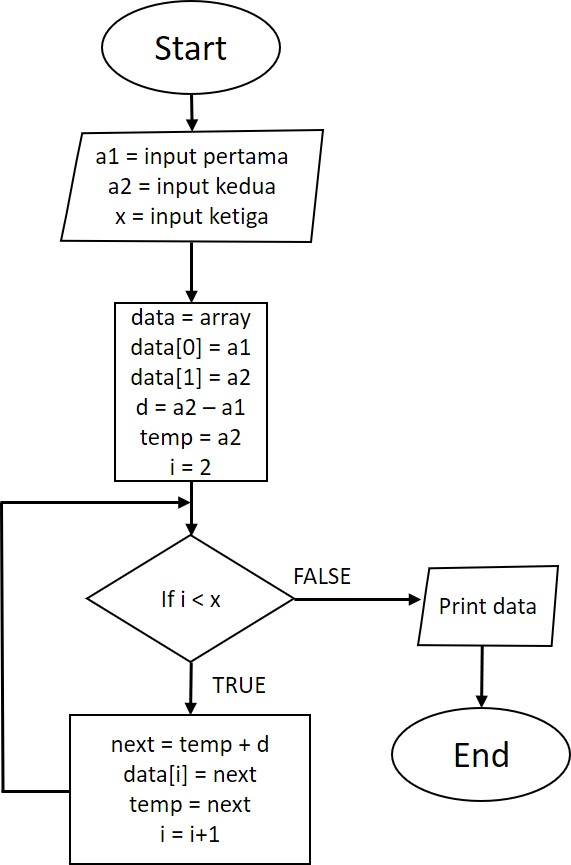

# Majoo Test Cases 3

## Buatkan flowchart dan pseudocodenya untuk menampilkan deret bilangan dengan inputan deret pertama, deret kedua dan nilai bilangan ke x!

### Contoh kasus pertama:

Inputan deret pertama = 2

Inputan deret kedua = 4

Value x = 5

Maka akan menghasilkan deret angka 2,4,6,8,10

### Contoh kasus kedua:

Inputan deret pertama = 5

Inputan deret kedua = 8

Value x = 7

Maka akan menghasilkan deret angka 5,8,11,14,17,20,23

---

## JAWABAN

### Pseucode terdapat pada file [main.go](main.go)

### Flowchart 

