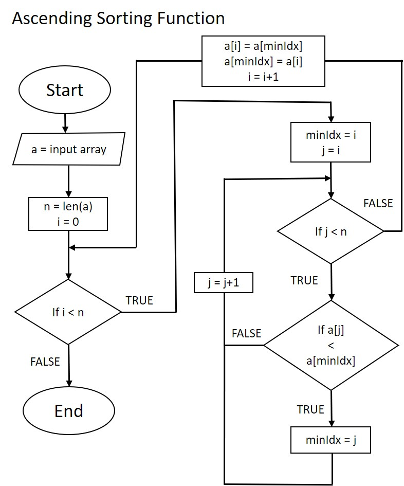
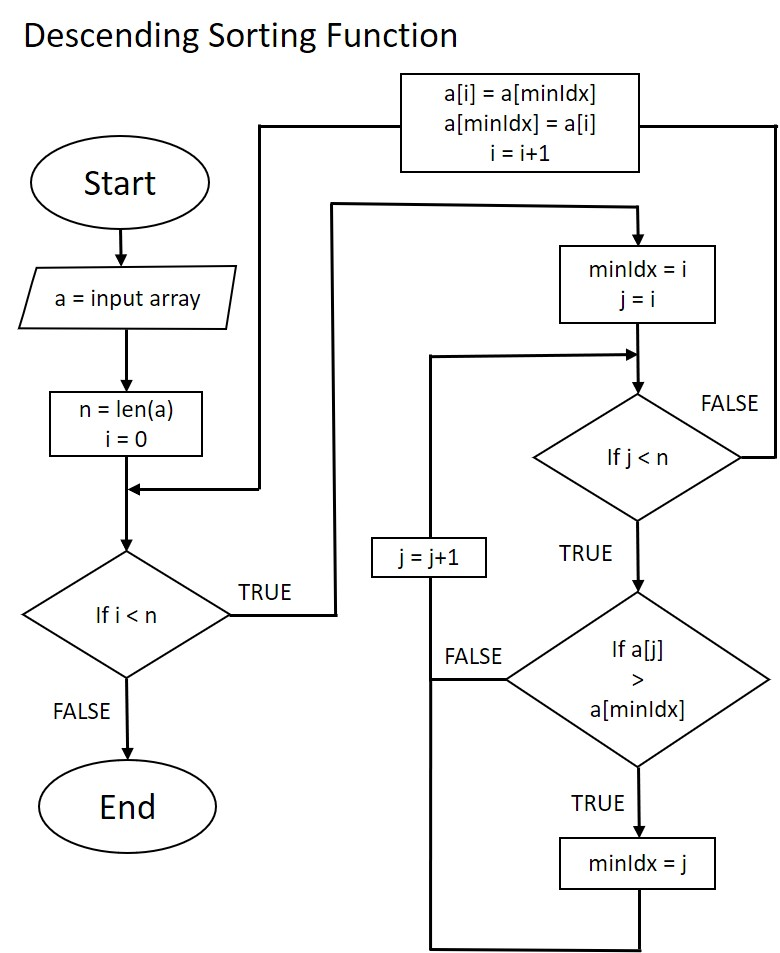

# Majoo Test Cases 4

## Terdapat variabel array dengan nilai [4, -7, -5, 3, 3.3, 9, 0, 10, 0.2]. Buatkan flowchart dan pseudocode untuk melakukan logical sorting variabel tersebut baik secara ascending maupun descending

    

### Hasil yang diharapkan ketika sorting secara ascending

[-7, -5, 0, 0.2, 3, 3.3, 4, 9, 10]

### Hasil yang diharapkan ketika sorting secara descending

[10, 9, 4, 3.3, 3, 0.2, 0, -5, -7]

---

## JAWABAN

### Pseucode terdapat pada file [main.go](main.go)

### Flowchart Ascending

### Flowchart Descending

